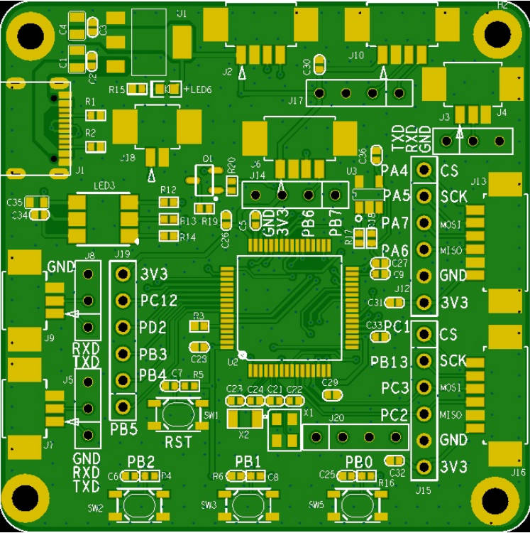
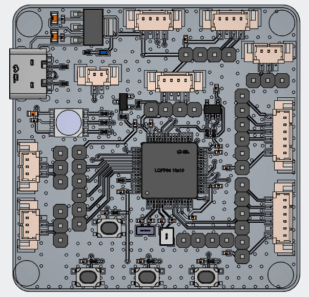

> 一款基于 STM32F205RXT6 的紧凑型多功能开发板，集成 Type-C 供电与常用外设，适合快速原型开发与嵌入式学习。
> A compact and multifunctional development board based on STM32F205RXT6, integrating Type-C power supply and commonly used peripherals, suitable for rapid prototyping and embedded learning.

 
 

## 特性

- **主控芯片**：STM32F205RXT6（ARM Cortex-M3，最高 120MHz，256KB~1MB Flash，128KB RAM）
- **供电与接口**
  - USB Type-C 输入 
  - 板载 3.3V LDO
  - USB 外设：USB 2.0 Full‑Speed OTG（Type-C 直连）
- **调试与复位**
  - 标准 SWD 调试接口
  - 独立复位按键（RST）
- **用户交互**
  - 3 个用户 LED（GPIO 控制）
  - 3 个用户按键（KEY，带上拉电阻）
- **扩展接口**
  - OLED / LCD 接口
  - EEPROM-AT24C02，I²C
  - UART*3 TTL 电平，排针引出
  - I²C & SPI 总线（排针引出，可与外部模块连接）
- **其他**
  - 所有 I/O 引脚均以 2.54mm 排针引出
  - 板载电源指示灯（PWR LED）
